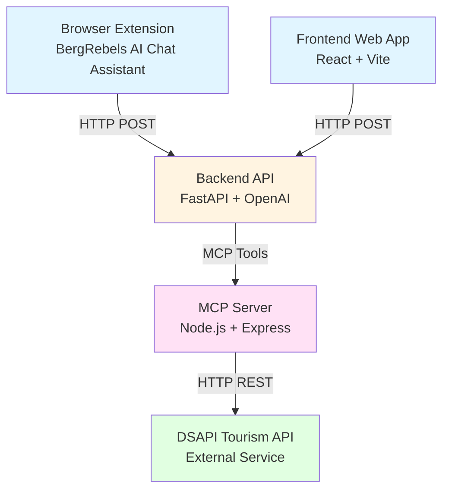

# Tourism Technology 2025 - Challenge 2

An AI-powered tourism experience discovery and booking platform for Kärnten (Carinthia), Austria. This project provides multiple interfaces for users to discover, search, and book tourism experiences through natural language conversations with an AI assistant.

## 📋 Overview

This project consists of four main components working together to provide a seamless tourism experience discovery platform:

- **MCP Server**: Model Context Protocol server that interfaces with the DSAPI Tourism API
- **Backend API**: FastAPI agent backend that processes user queries and orchestrates AI responses
- **Frontend Web App**: React-based web application with a ChatGPT-style interface
- **Browser Extension**: Chrome/Firefox extension (BergRebels AI Chat Assistant) for quick access to the AI assistant

## ✨ Features

- 🤖 **AI-Powered Discovery**: Natural language conversations to discover tourism experiences
- 🔍 **Advanced Search**: Filter experiences by type, location, holiday themes, and guest cards
- 📅 **Date-Based Queries**: Search for experiences available on specific dates
- 🌍 **Multi-Language Support**: German (de), English (en), and Italian (it)
- 💰 **Multi-Currency Support**: EUR, USD, and GBP
- 🛒 **Shopping Cart Integration**: Add items to baskets and generate checkout URLs
- 📱 **Multiple Interfaces**: Web application and browser extension
- 🔐 **Secure Authentication**: Automatic DSAPI authentication handling

## 🏗️ Architecture



## 📦 Components

### 1. MCP Server (`/mcp-server`)

A Model Context Protocol server that provides seamless access to the DSAPI Tourism API. It handles authentication, request routing, and data transformation.

**Key Features:**
- Experience search and filtering
- Product information retrieval
- Shopping cart management
- Automatic authentication and token caching

**Technologies:** TypeScript, Node.js, Express, MCP SDK

**Documentation:** See [mcp-server/README.md](mcp-server/README.md)

### 2. Backend API (`/backend`)

A FastAPI-based agent backend that processes user queries using OpenAI/Azure OpenAI and connects to the MCP server to fetch tourism data.

**Key Features:**
- Natural language processing
- Conversation management
- Tool integration with MCP server
- CORS-enabled for web and extension access

**Technologies:** Python, FastAPI, agent-framework, OpenAI SDK

**Documentation:** See [backend/README.md](backend/README.md)

### 3. Frontend Web App (`/frontend`)

A modern React web application with a ChatGPT-style interface for discovering and booking tourism experiences.

**Key Features:**
- Beautiful, responsive UI built with shadcn/ui
- Conversation persistence (localStorage)
- Real-time chat interface
- Markdown rendering with code highlighting

**Technologies:** React, TypeScript, Vite, Tailwind CSS, shadcn/ui

**Documentation:** See [frontend/README.md](frontend/README.md)

### 4. Browser Extension (`/browser-extension`)

A Chrome/Firefox browser extension called "BergRebels AI Chat Assistant" that provides quick access to the AI assistant from any webpage.

**Key Features:**
- Lightweight popup interface
- Quick access from browser toolbar
- Seamless integration with backend API
- Privacy-focused (minimal data collection)

**Status:** ⏳ Currently awaiting approval for publication on Google Chrome Web Store

**Technologies:** React, TypeScript, WXT Framework

**Documentation:** See [browser-extension/wxt-dev-wxt/README.md](browser-extension/wxt-dev-wxt/README.md)

## 🚀 Quick Start

### Prerequisites

- **Node.js** 18+ (for MCP server and frontend)
- **Python** 3.12+ (for backend)
- **uv** (Python package manager)
- **npm** or **pnpm** (Node.js package manager)

### Installation

1. **Clone the repository:**
   ```bash
   git clone <repository-url>
   cd tourism-technology-2025
   ```

2. **Set up the MCP Server:**
   ```bash
   cd mcp-server
   npm install
   npm run build
   ```

3. **Set up the Backend:**
   ```bash
   cd ../backend
   pip install uv
   uv python install 3.12
   # Create .env file with API_KEY
   uv run fastapi dev
   ```

4. **Set up the Frontend:**
   ```bash
   cd ../frontend
   npm install
   # Set VITE_AGENT_URL in .env if needed
   npm run dev
   ```

5. **Set up the Browser Extension:**
   ```bash
   cd ../browser-extension/wxt-dev-wxt
   npm install
   npm run dev
   ```

## 🔧 Configuration

### Backend Configuration

Create a `.env` file in the `backend/` directory:

```env
API_KEY=your-openai-api-key
```

### Frontend Configuration

Create a `.env` file in the `frontend/` directory (optional):

```env
VITE_AGENT_URL=http://localhost:8000/agent
```

### MCP Server Configuration

The MCP server uses default DSAPI credentials. To customize, modify `mcp-server/src/index.ts`:

```typescript
const DSAPI_BASE = "https://dsapi.deskline.net";
const DEFAULT_USERNAME = "your-username";
const DEFAULT_PASSWORD = "your-password";
```

## 📁 Project Structure

```
tourism-technology-2025/
├── backend/                 # FastAPI backend agent
│   ├── main.py              # Main application
│   ├── pyproject.toml       # Python dependencies
│   └── README.md
├── browser-extension/       # Chrome/Firefox extension
│   └── wxt-dev-wxt/
│       ├── entrypoints/     # Extension entry points
│       ├── components/      # React components
│       └── README.md
├── frontend/                # React web application
│   ├── src/
│   │   ├── AIChatbot.tsx   # Main chatbot component
│   │   └── lib/            # API utilities
│   └── README.md
├── mcp-server/             # MCP server for DSAPI
│   ├── src/
│   │   └── index.ts        # Main server implementation
│   └── README.md
├── LICENSE                  # MIT License
├── PRIVACY_POLICY.md        # Privacy policy for extension
└── README.md               # This file
```

## 🛠️ Development

### Running in Development Mode

1. **Start the MCP Server:**
   ```bash
   cd mcp-server
   npm run build
   node build/index.js
   ```

2. **Start the Backend:**
   ```bash
   cd backend
   uv run fastapi dev
   ```

3. **Start the Frontend:**
   ```bash
   cd frontend
   npm run dev
   ```

4. **Start the Browser Extension:**
   ```bash
   cd browser-extension/wxt-dev-wxt
   npm run dev
   ```

### Building for Production

**MCP Server:**
```bash
cd mcp-server
npm run build
```

**Frontend:**
```bash
cd frontend
npm run build
```

**Browser Extension:**
```bash
cd browser-extension/wxt-dev-wxt
npm run build
npm run zip  # Creates extension package
```

## 🐳 Docker

### MCP Server

```bash
cd mcp-server
docker build -t dsapi-mcp-server .
docker run -p 3000:3000 dsapi-mcp-server
```

## 🌐 Deployment

The project components are deployed on Google Cloud Platform:

- **Backend API**: `https://ttf-backend-665542325765.europe-central2.run.app`
- **MCP Server**: `https://ttf-mcp-server-665542325765.europe-central2.run.app`

## 📚 API Documentation

### Backend API

**Endpoint:** `POST /agent`

**Request Body:**
```json
{
  "messages": [
    {
      "role": "user",
      "content": "Find hiking experiences in Kärnten"
    }
  ]
}
```

**Response:**
```json
{
  "answer": "I found several hiking experiences..."
}
```

### MCP Server Tools

See [mcp-server/README.md](mcp-server/README.md) for detailed documentation of available MCP tools.

## 🔒 Privacy & Security

- **Privacy Policy**: See [PRIVACY_POLICY.md](PRIVACY_POLICY.md)
- The browser extension collects minimal data (only chat messages)
- All communications use HTTPS encryption
- No personal identifiers are stored

## 📄 License

This project is licensed under the MIT License - see the [LICENSE](LICENSE) file for details.

## 🤝 Contributing

This project was created for the Tourism Technology 2025 Challenge 2. Contributions and improvements are welcome!

## 🔗 Related Resources

- [DSAPI Tourism API Documentation](https://dsapi.deskline.net)
- [Model Context Protocol](https://modelcontextprotocol.io)
- [WXT Framework](https://wxt.dev)

## 📝 Notes

- The browser extension is currently awaiting approval for publication on the Google Chrome Web Store
- All components are designed to work independently or together
- The MCP server can be used with any MCP-compatible client

---

**Built for Tourism Technology 2025 - Challenge 2**

[Link to pitch presentation](https://www.canva.com/design/DAG4MbazJ_4/J8kqmC1fZKOesKXtyEqhfA/edit?utm_content=DAG4MbazJ_4&utm_campaign=designshare&utm_medium=link2&utm_source=sharebutton)
